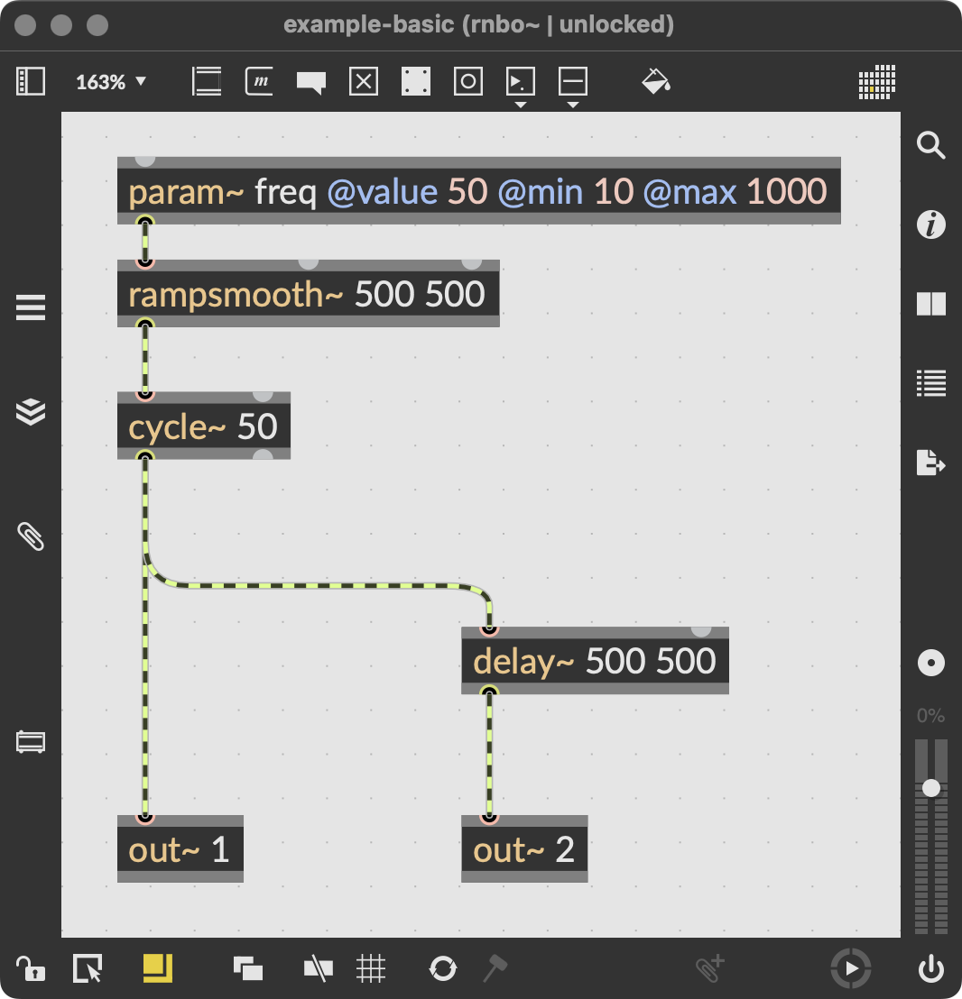
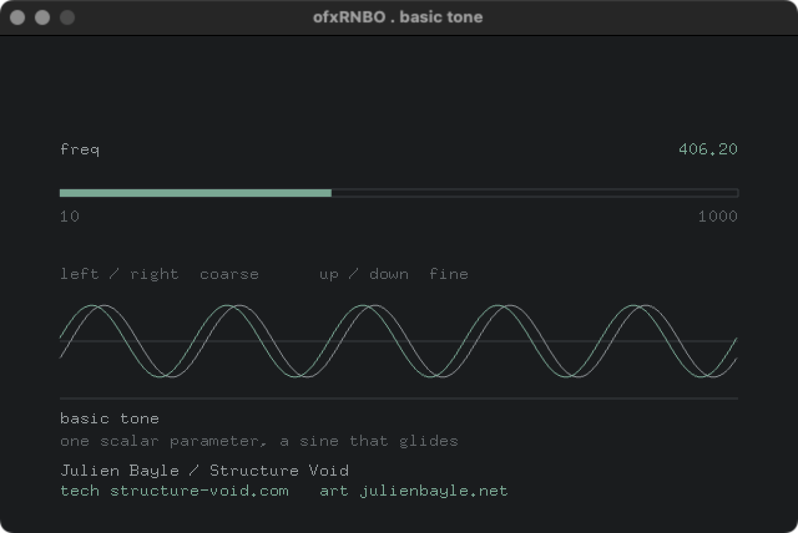

# example-basic

The reference example. One scalar parameter driven from openFrameworks into a RNBO
patch: a sine whose pitch glides when you change it.

This is the pattern every other ofxRNBO example copies: a source Max patch that ships,
a generated export that you produce yourself, and a fixed, sober UI.

| RNBO patch | openFrameworks GUI |
| --- | --- |
|  |  |

## What it demonstrates

- A single scalar parameter (`freq`) set from oF with `setParameter`.
- Audio playing through `ofSoundStream`, de/interleaved by the wrapper.
- A gliding pitch: the patch smooths parameter changes, so the sine slides rather
  than jumps.

## Patch to export, the three-step drill

An example does not run out of the box. You produce the export yourself from the
patch that ships with it.

1. Open `rnbo-patch/` in Max and load the provided `.maxpat`.
2. Export it with the RNBO C++ Source Code Export into `example-basic/rnbo-export/`.
   Use the standard export, not the Minimal Export. Keep RNBO's default export name
   so it produces `rnbo_source.cpp`; the build looks for it there.
3. Build the example and listen. See Building below.

The `rnbo-export/` folder is git-ignored: the RNBO runtime is Cycling '74 licensed
and is never committed. The `rnbo-patch/` folder is versioned: the source patch is
the author's own and ships with the example.

## Building

Two ways to build. On recent macOS the openFrameworks template still links the AGL
framework, which the current SDK no longer ships, so the link fails until AGL is
removed. The Project Generator route below shows exactly how; a command-line build
needs the same framework dropped from your openFrameworks core linker configuration.

### Command line

From this example's folder:

```bash
make
make RunRelease
```

### Project Generator and Xcode

1. Open the openFrameworks Project Generator, point it at this example, and make
   sure the `ofxRNBO` addon is included. Generate the project.
2. Open the generated `.xcodeproj`.
3. Remove the AGL framework. In Build Settings, search for `AGL`. Everywhere
   `-framework AGL` appears, remove only that flag and leave the other frameworks
   in place:
   - Other Linker Flags, under Linking - General
   - OF_CORE_FRAMEWORKS, under User-Defined

   Do this at both the Project level and the Target level.
4. Build.

## What to see and hear

A fixed window, dark and monospace. The parameter `freq`, its value, and a thin
slider showing where it sits in range. Arrow keys move it: left and right coarse,
up and down fine. You should hear a sine tone whose pitch glides to each new value.

If the window says "no export loaded", you have not exported the patch into
`rnbo-export/` yet. Do the three steps above and rebuild.

## Note

A green build proves nothing about the sound. The judge is what comes out of
ofSoundStream, checked by ear with the real export.
