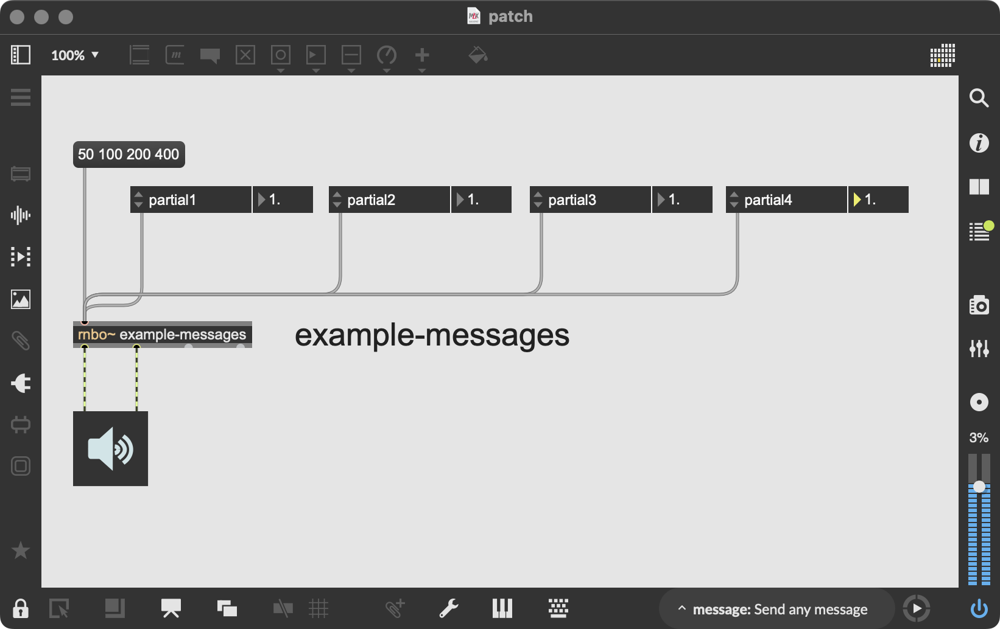
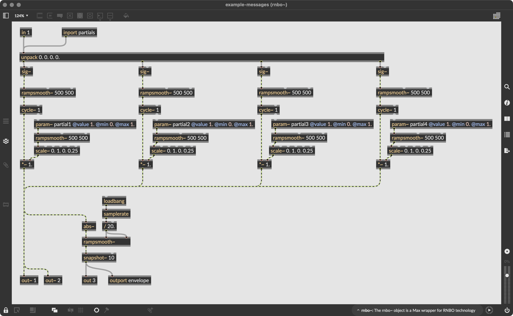
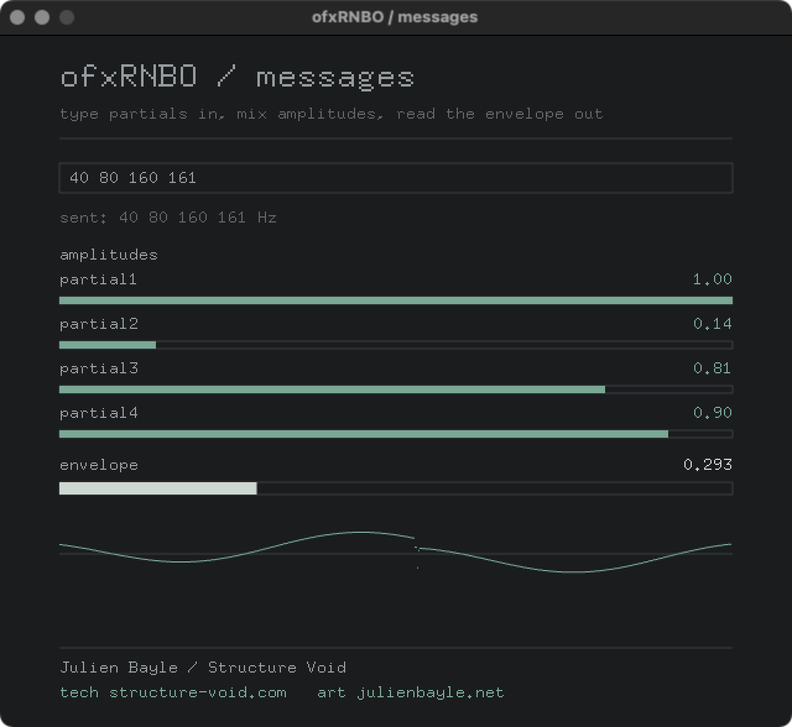

# example-messages

Two-way messaging between openFrameworks and a RNBO patch. You type partial
frequencies in oF, the patch receives them and drives four additive partials;
you mix the four amplitudes live; and the patch sends a level envelope back,
which oF reads and shows as a meter.

| patch | openFrameworks |
| --- | --- |
| <br> |  |

## What it demonstrates

- Sending a list to a named inport: the typed frequencies go to inport
  `partials` with `ofxRNBO::sendMessage`.
- Setting scalar parameters live: four sliders drive params `partial1` to
  `partial4`, the partial amplitudes.
- Reading an outport: the patch emits a level on outport `envelope` (a snapshot~
  every 10 ms), read with `ofxRNBO::getOutportValue("envelope")` and shown as a
  meter. This is the RNBO to oF return path.

## Patch to export, the three-step drill

An example does not run out of the box. You produce the export yourself from the
patch that ships with it.

1. Open `rnbo-patch/` in Max and load the provided `.maxpat`.
2. Export it with the RNBO C++ Source Code Export into `example-messages/rnbo-export/`.
   Use the standard export, not the Minimal Export. Keep RNBO's default export name
   so it produces `rnbo_source.cpp`; the build looks for it there.
3. Build the example. See Building below.

The `rnbo-export/` folder is git-ignored: the RNBO runtime is Cycling '74 licensed
and is never committed. The `rnbo-patch/` folder is versioned: the source patch is
the author's own and ships with the example.

The patch must expose: an inport `partials` taking a list of frequencies, four
params `partial1` to `partial4` for the amplitudes, and an outport `envelope`
emitting a level. Names matter; the oF code addresses them by these names.

## Building

Two ways to build. On recent macOS the openFrameworks template still links the AGL
framework, which the current SDK no longer ships, so the link fails until AGL is
removed. The Project Generator route below shows exactly how; a command-line build
needs the same framework dropped from your openFrameworks core linker configuration.

### Command line

From this example's folder:

```bash
make
make RunRelease
```

### Project Generator and Xcode

1. Open the openFrameworks Project Generator, point it at this example, and make
   sure the `ofxRNBO` addon is included. Generate the project.
2. Open the generated `.xcodeproj`.
3. Remove the AGL framework. In Build Settings, search for `AGL`. Everywhere
   `-framework AGL` appears, remove only that flag and leave the other frameworks
   in place:
   - Other Linker Flags, under Linking - General
   - OF_CORE_FRAMEWORKS, under User-Defined

   Do this at both the Project level and the Target level.
4. Build.

## What to see and hear

A fixed window, dark and monospace. A text field at the top: type frequencies
separated by spaces, for example `50 100 200 220`, and press enter to send them
to the patch. Four amplitude sliders below, dragged with the mouse, mix the four
partials. At the bottom, a meter shows the envelope the patch sends back.

If the window says "no export loaded", you have not exported the patch into
`rnbo-export/` yet. Do the three steps above and rebuild.

## Note

A green build proves nothing about the sound or the messaging. The judge is what
comes out of ofSoundStream and what the meter shows, checked by ear and eye with
the real export.
