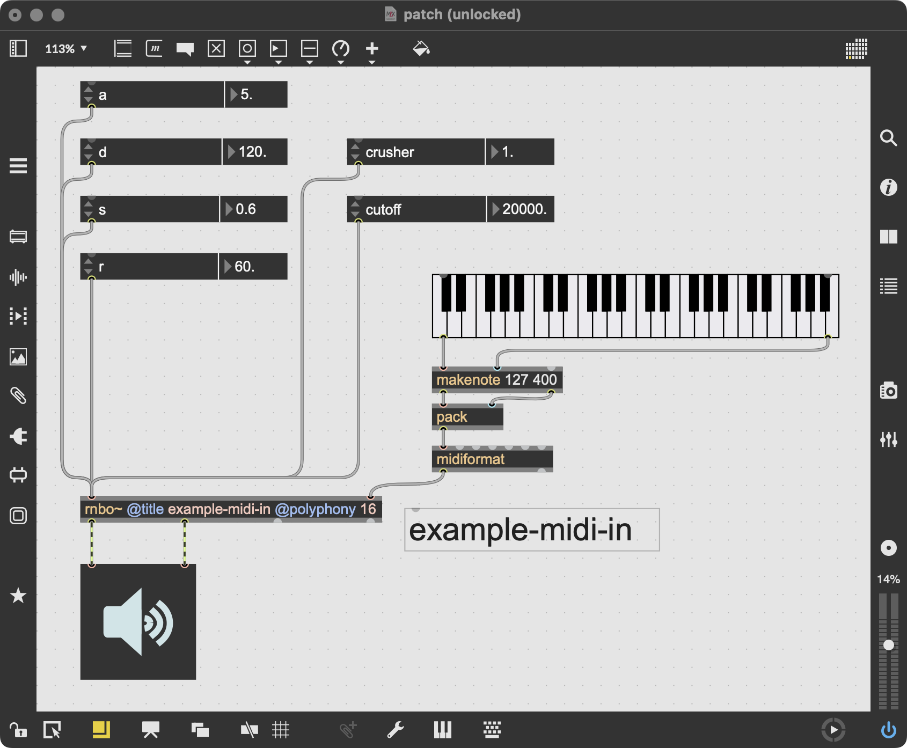
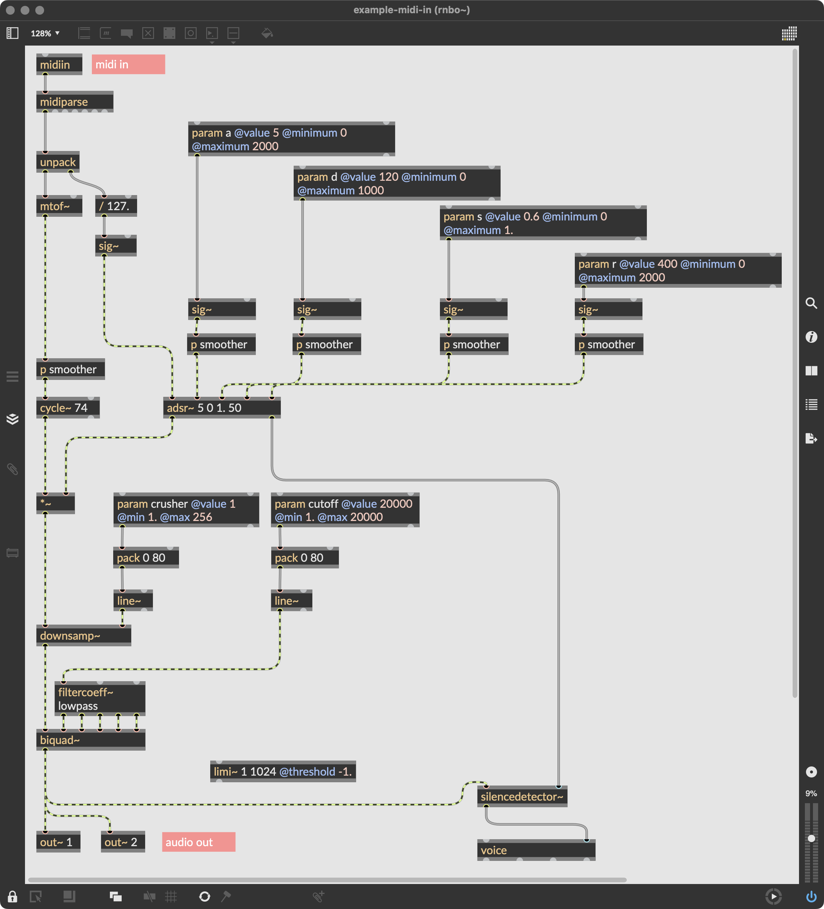
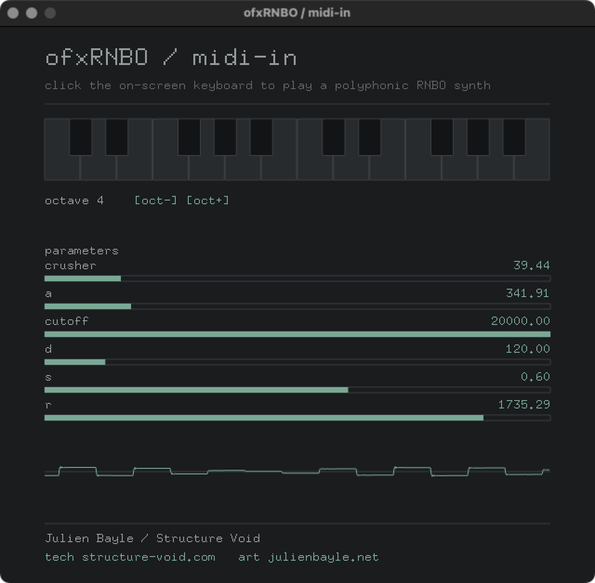

# example-midi-in

MIDI notes from openFrameworks into a RNBO synth. You play a polyphonic RNBO synth
by clicking an on-screen keyboard with the mouse. The patch has an ADSR envelope, a
bit-crusher and a lowpass filter: click a key to sound a note, release to let it go.

| patch | openFrameworks |
| --- | --- |
| <br> |  |

## What it demonstrates

- Sending MIDI note-on and note-off from oF into RNBO with
  `ofxRNBO::sendMidiNote`, the upstream MIDI path.
- Playing from an on-screen keyboard with the mouse: click a key for note-on,
  release for note-off, drag across keys to slide from one note to the next.
- The synth itself is polyphonic, the export provides several voices. The mouse
  plays one note at a time, so you hear the synth note by note rather than as a
  held chord.
- The synth parameters, read from the export and driven live from sliders: the
  ADSR (`a d s r`), the crusher and the cutoff.

No external MIDI and no ofxMidi; you play with the mouse. An external MIDI input
example comes separately.

## Keyboard

Play with the mouse on the on-screen keyboard:

- Click a key for note-on, release for note-off.
- Drag with the button held to slide from one key to the next: the note you leave
  stops and the note you enter starts, one note at a time.
- The key lights up in the accent colour on the note being played.
- `[oct-]` and `[oct+]` under the keyboard shift the octave, shown next to them.

## Patch to export, the three-step drill

An example does not run out of the box. You produce the export yourself from the
patch that ships with it.

1. Open `rnbo-patch/` in Max and load the provided `.maxpat`.
2. Export it with the RNBO C++ Source Code Export into `example-midi-in/rnbo-export/`.
   Use the standard export, not the Minimal Export. Keep RNBO's default export name
   so it produces `rnbo_source.cpp`; the build looks for it there.
3. Build the example. See Building below.

The `rnbo-export/` folder is git-ignored: the RNBO runtime is Cycling '74 licensed
and is never committed. The `rnbo-patch/` folder is versioned: the source patch is
the author's own and ships with the example.

The patch is a MIDI-driven polyphonic synth: a notein feeds a voice with an ADSR,
a bit-crusher and a lowpass filter, stereo out. Its parameters `a d s r`, `crusher`
and `cutoff` appear as sliders.

## Building

Two ways to build. On recent macOS the openFrameworks template still links the AGL
framework, which the current SDK no longer ships, so the link fails until AGL is
removed. The Project Generator route below shows exactly how; a command-line build
needs the same framework dropped from your openFrameworks core linker configuration.

### Command line

From this example's folder:

```bash
make
make RunRelease
```

### Project Generator and Xcode

1. Open the openFrameworks Project Generator, point it at this example, and make
   sure the `ofxRNBO` addon is included. Generate the project.
2. Open the generated `.xcodeproj`.
3. Remove the AGL framework. In Build Settings, search for `AGL`. Everywhere
   `-framework AGL` appears, remove only that flag and leave the other frameworks
   in place:
   - Other Linker Flags, under Linking - General
   - OF_CORE_FRAMEWORKS, under User-Defined

   Do this at both the Project level and the Target level.
4. Build.

## What to see and hear

A fixed window, dark and monospace. A two-octave keyboard that lights the note
being played, the current octave with its two shift buttons, and below, a slider
for each synth parameter. At the bottom, a mono scope of the output. Click and drag
on the keyboard and you should hear the RNBO synth, with its ADSR shaping each note.

If the window says "no export loaded", you have not exported the patch into
`rnbo-export/` yet. Do the three steps above and rebuild.

## Note

A green build proves nothing about the sound. The judge is what comes out of
ofSoundStream, checked by ear with the real export.
